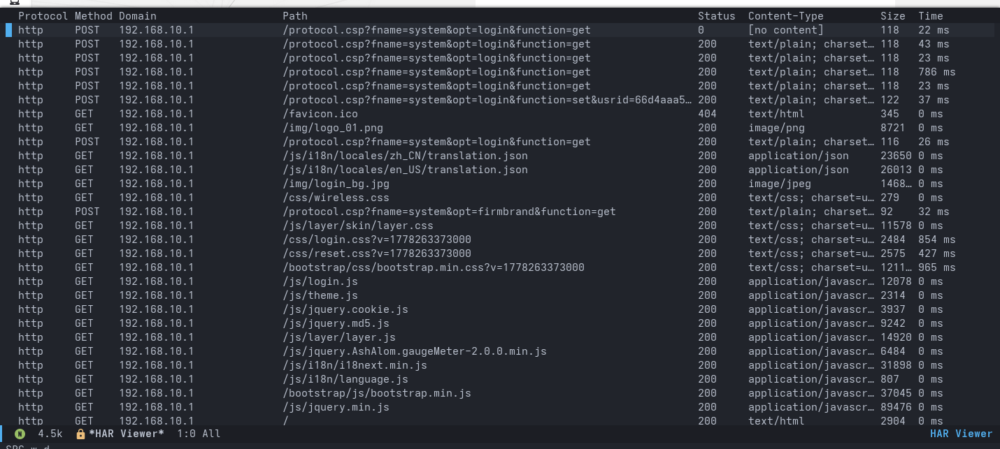
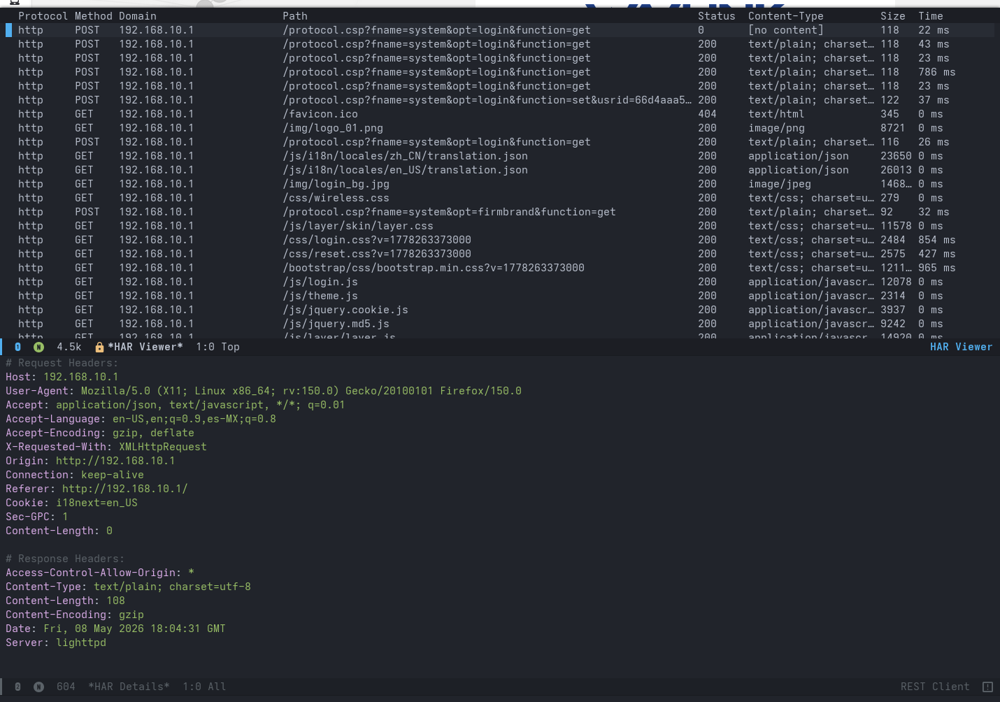
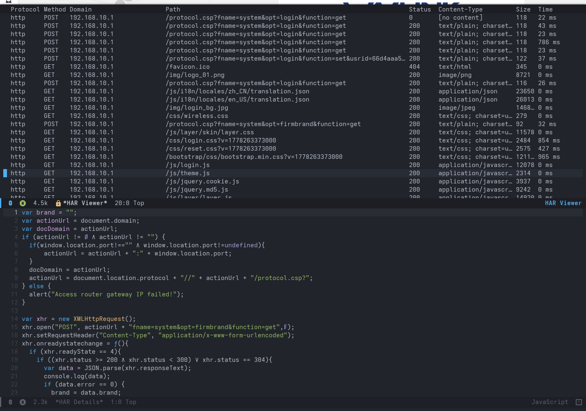

#+title: har-viewer.el
#+author: Gregory Newman
#+email: bozoslivehere@protonmail.com
#+language: en

A major mode for viewing HTTP Archive (HAR) files in Emacs. HAR files
capture browser network activity and are exported from tools such as
browser DevTools, Burp Suite, Charles Proxy, and mitmproxy.
~har-viewer~ renders the request list as a sortable table and provides
commands to inspect headers, bodies, and copy requests as cURL
commands.

#+attr_org: :width 800

* Installation

** TODO From MELPA

Note: this is pending recipe approval as of this commit.

#+begin_src emacs-lisp
(package-install 'har-viewer)
(har-viewer-global-minor-mode 1)
#+end_src

Or with ~use-package~:

#+begin_src emacs-lisp
(use-package har-viewer
  :config
  (har-viewer-global-minor-mode 1))
#+end_src

** Manual

Clone the repository and add it to your load path:

#+begin_src emacs-lisp
(add-to-list 'load-path "/path/to/har-viewer.el")
(require 'har-viewer)
(har-viewer-global-minor-mode 1)
#+end_src

Enabling ~har-viewer-global-minor-mode~ automatically binds =C-c C-v= in
any =.har= buffer and prevents ~so-long-mode~ from replacing the buffer
when files are large.

* Usage

Open a =.har= file in Emacs and press =C-c C-v= to open the viewer.
Alternatively, call ~har-viewer-view~ interactively from any buffer
containing HAR JSON.

The viewer opens in a =*HAR Viewer*= buffer showing all requests as a
sortable table.  A =*HAR Details*= pane below shows header and body
output.

* Keybindings

Bindings active in the =*HAR Viewer*= buffer:

| Key       | Command                            | Description                       |
|-----------+------------------------------------+-----------------------------------|
| =RET=     | ~har-viewer-display-headers~       | Show request and response headers |
| =C-c C-r= | ~har-viewer-display-response-body~ | Show response body                |
| =C-c C-p= | ~har-viewer-display-request-body~  | Show request body                 |
| =C-c C-c= | ~har-viewer-copy-as-curl~          | Copy entry as a cURL command      |
| =C-c C-n= | ~har-viewer-narrow-to-regex~       | Filter list by URL regex          |

With [[https://github.com/emacs-evil/evil][evil-mode]] the following normal-state bindings are also available:

| Key   | Description                       |
|-------+-----------------------------------|
| =RET= | Show request and response headers |
| =yc=  | Copy entry as a cURL command      |

* Headers and Bodies

Pressing =RET= opens a =*HAR Details*= pane showing requesg and
response headers. If [[https://github.com/pashky/restclient.el][restclient]] is installed the pane uses
~restclient-mode~ for syntax highlighting automatically.

#+attr_org: :width 800

=C-c C-r= shows the response body and =C-c C-p= shows the request
body, each in a =*HAR Details*= pane set to the appropriate major mode
for the content type (JSON, HTML, CSS, JavaScript). If [[https://github.com/yasuyk/web-beautify][web-beautify]] is
installed, and =har-viewer-beautify-bodies= is set to =t=, the source
code for JS/TS, CSS, HTML, and XML will be automatically beautified in
the pane.

#+attr_org: :width 800

* Copy as cURL

Pressing =C-c C-c= (or =yc= in evil normal state) copies a shell-ready
cURL invocation for the entry at point to the kill ring.  The command
includes all request headers and, where present, the request body:

#+begin_src shell
curl -X 'GET' \
  'http://192.168.10.1/js/theme.js' \
  -H 'Host: 192.168.10.1' \
  -H 'User-Agent: Mozilla/5.0 (X11; Linux x86_64; rv:150.0) Gecko/20100101 Firefox/150.0' \
  -H 'Accept: */*' \
  -H 'Accept-Language: en-US,en;q=0.9,es-MX;q=0.8' \
  -H 'Accept-Encoding: gzip, deflate' \
  -H 'Connection: keep-alive' \
  -H 'Referer: http://192.168.10.1/' \
  -H 'Cookie: i18next=en_US'
#+end_src

Single quotes within header values or body text are shell-escaped
automatically.

* Filtering

=C-c C-n= prompts for a regular expression and narrows the list to
entries whose domain + path match it. Call the command again with a
new pattern to change the filter, or with an empty string to reset.

* Configuration

** Auto-format body buffers

Install [[https://github.com/yasuyk/web-beautify][web-beautify]] and set:

#+begin_src emacs-lisp
(setq har-viewer-beautify-bodies t)
#+end_src

Response and request body buffers will then be auto-formatted
according to their content type (JSON, HTML, CSS, JavaScript).
Requires Node.js and the =js-beautify= npm package.

** Header syntax highlighting

Install [[https://github.com/pashky/restclient.el][restclient]] to have header buffers opened in ~restclient-mode~
for syntax highlighting. No configuration is required; the mode is
activated automatically when the package is present.

* Dependencies

| Package      | Required | Notes                                     |
|--------------+----------+-------------------------------------------|
| Emacs 26.1+  | Yes      | Built-ins ~json~ and ~url-parse~ are used |
| evil         | No       | Adds normal-state bindings when loaded    |
| restclient   | No       | Header syntax highlighting                |
| web-beautify | No       | Body auto-formatting (requires Node.js)   |

* License

This program is free software; you can redistribute it and/or modify
it under the terms of the GNU General Public License as published by
the Free Software Foundation, either version 3 of the License, or (at
your option) any later version.
